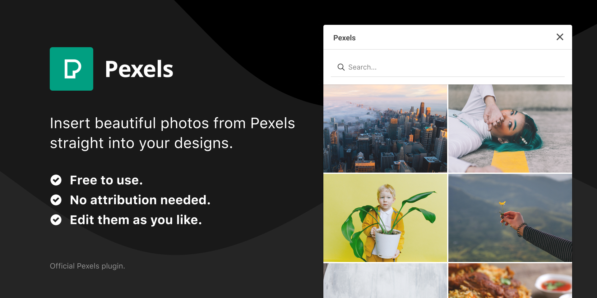

# Unofficial Pexels Figma Plugin


A Figma plugin to insert photos from the popular free stock photography site Pexels.

## Build instructions

First clone the repository and install the dev dependencies:

```
git clone git@github.com:craigmdennis/figma-pexels.git
cd figma-pexels
npm install
```

Then compile the source files:

```
npm run watch
```

```
npm run build
```

The main plugin code is in `src/code.ts`. The HTML for the UI is in
`src/ui.html`, while the embedded JavaScript is in `src/ui.ts`.

These are compiled to files in `dist/`, which are what Figma will use to run
the plugin.
