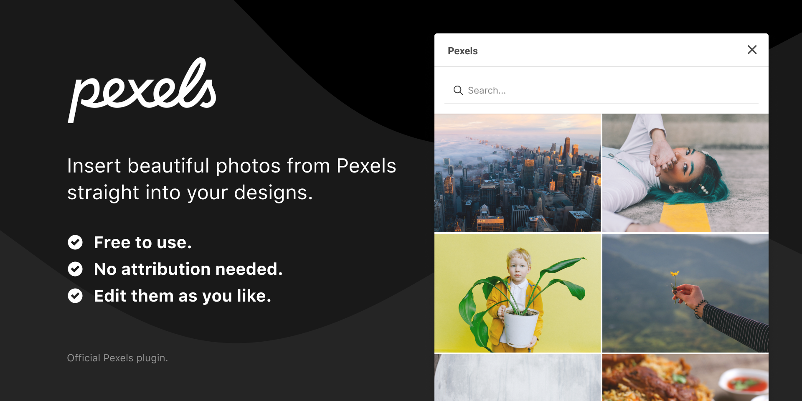

# Pexels Figma Plugin


A Figma plugin to insert photos from the popular free stock photography site Pexels. All Pexels plugins are [listed on the website](https://www.pexels.com/pro/).

## Photo Usage Licence

- All photos and videos on Pexels are free to use.
- Attribution is not required. Giving credit to the photographer or Pexels is not necessary but always appreciated.
- You can modify the photos and videos from Pexels. Be creative and edit them as you like.

[View the Licence →](https://www.pexels.com/license/)

## Build instructions

The main plugin code is in `src/code.ts`. The HTML for the UI is in
`src/ui.html`, while the embedded JavaScript is in `src/ui.ts`. These are compiled to files in `dist/` by Webpack and are what Figma will use to run the plugin.

### Clone the repository and install the dependencies

```
git clone git@github.com:craigmdennis/figma-pexels.git
cd figma-pexels
yarn install
```

### Generate an API key

- Visit https://www.pexels.com/api/ and click on "Request Access".
- Duplicate and rename `secrets.sample.js` to `secrets.js` and add the API key.

## Compile the source files

Run once.

```
yarn build
```

Watch for changes.

```
yarn build:watch
```

## Point Figma to the plugin

- Open Figma and open any design file (or create a new one) so the “Plugins” app menu item is shown.
- From the app menu bar go to Plugins → Development → New Plugin.
- Under “Link existing plugin” select the `manifest.json` file in the unzipped plugin folder.
